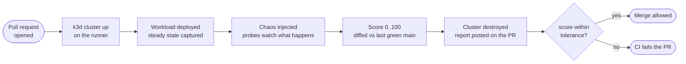
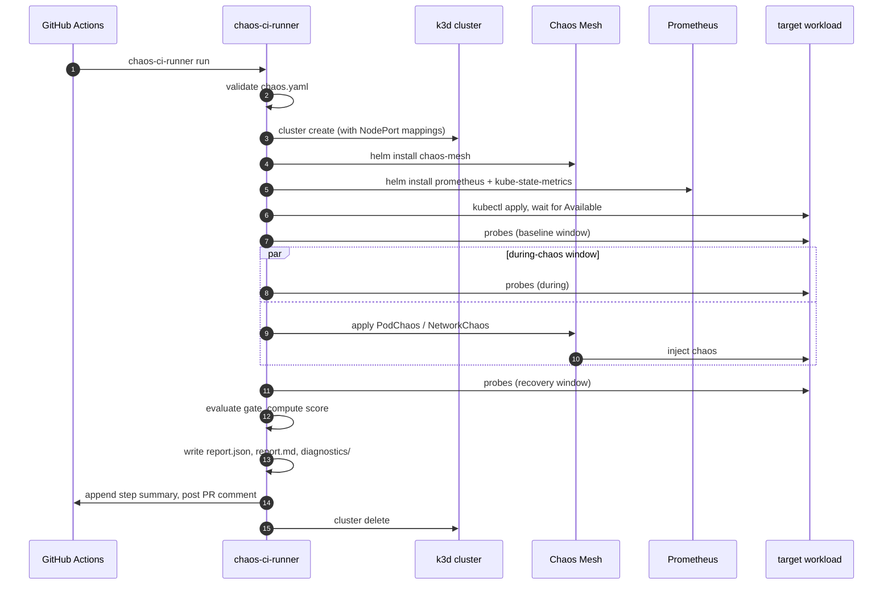
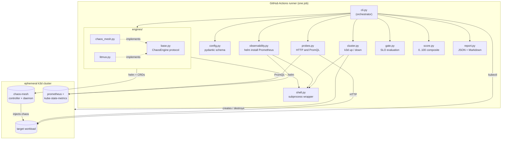
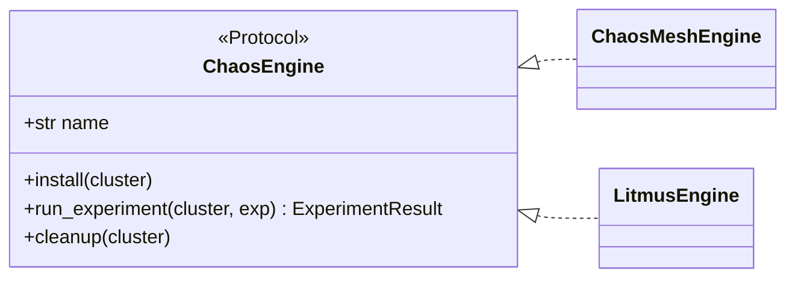
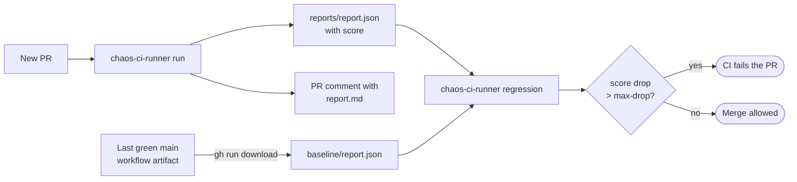

# chaos-ci-runner

A small, opinionated tool that runs Kubernetes chaos experiments
inside CI. No shared cluster to keep alive, no operator to install
ahead of time, no SaaS account. You commit a chaos.yaml, open a
PR, and within a couple of minutes you have a single number that
tells you whether the change made the system more resilient or
less.



The whole loop fits in roughly three minutes on a stock GitHub
Actions runner.

## About

Many teams want chaos engineering and never get
to it. The reason is almost always the same: existing chaos tools
assume a long-lived cluster, an installed operator, dedicated team to
mind it, and a runbook per experiment. By the time that scaffolding
is in place, the people who asked for it have moved on to the next
quarter's priorities.

CI already gives us the properties chaos testing needs. Runners are
clean, the network is clean, secrets are scoped, and nothing leaks
across pull requests. That is the right place to spin up a tiny
cluster, deploy the workload, kill some pods, watch what breaks,
and throw the cluster away. Run it on every PR. Track the result
the way teams already track coverage.

This repository is the smallest implementation of that idea I could
write without cutting corners on the parts team actually cares about:
steady-state SLO probes, a graded gate, a single-number resilience
score, and a regression check against the previous green run on
main.

## Problems it is built to solve

1. **The adoption tax for chaos engineering is too high.** A team
   shouldn't need a platform engineering effort to start. Wiring
   chaos-ci-runner into a repo is a config file and a six-line
   reusable workflow.
2. **Resilience regressions slip through review.** A retry timeout
   that crept up, a readiness probe that became too strict, a
   deployment surge that accidentally became zero. All of these
   show up in the score the day they are committed.
3. **Production chaos tools are the wrong shape for CI.** They
   assume long-running infrastructure and slow human approvals.
   This tool is the opposite: ephemeral, headless, and designed to
   gate a merge.
4. **Resilience is not a tracked metric.** Coverage is. Lint is.
   "Did this PR make the system more or less resilient" usually
   isn't, because there has been no number to point at. A 0-100
   score and a regression diff give reviewers something concrete.
5. **Reports buried in CI logs are not reports.** The reusable
   workflow posts the rendered report as a PR comment, so the
   reviewer sees it before the diff.

What this is *not* meant for: production chaos. Production chaos
belongs with tools that integrate with change management, paging,
and live SLOs. The blast radius here ends when the CI runner shuts
down.

## Use cases in practice

- **Per-PR resilience gate.** Every PR runs the same chaos
  scenario. If the score drops by more than the configured
  tolerance against the previous green main, the PR is blocked.
- **Standard onboarding for new services.** New microservice repos
  ship with `chaos-ci-runner` wired in alongside unit tests, so
  resilience is a first-class concern from commit one rather than
  a handover item once the service is in production.
- **Executable resilience contracts.** The `chaos.yaml` is a
  declarative description of what the service is supposed to
  survive. It lives next to the Kubernetes manifests in the same
  repo and is reviewed the same way.
- **Catching infrastructure regressions, not just code.** Helm
  chart bumps, base-image bumps, manifest refactors. All show up
  in the same gate.
- **Cross-team baselining.** Once enough services have a score on
  every PR, leaders have a real signal for which services need
  resilience investment, instead of asking around.

## Quickstart

A repo adopts this in two files.

`chaos.yaml`:

```yaml
cluster:
  port_mappings: ["30080:30080@server:0"]

observability:
  prometheus: true                    # in-cluster Prometheus + kube-state-metrics

target:
  manifest: ./k8s/app.yaml
  namespace: default
  ready_timeout_s: 120

steady_state:
  http_probes:
    - { name: api, url: http://localhost:30080/healthz,
        success_rate_pct: 99, latency_p99_ms: 200 }
  prometheus_probes:
    - name: pods-ready
      query: 'sum(kube_pod_status_ready{namespace="default", condition="true"})'
      min: 2

experiments:
  - { name: pod-kill, engine: chaos-mesh, kind: PodChaos, duration_s: 20,
      spec: { action: pod-kill, mode: one,
              selector: { labelSelectors: { app: my-app } } } }
  - { name: net-delay, engine: chaos-mesh, kind: NetworkChaos, duration_s: 30,
      spec: { action: delay, mode: all,
              selector: { labelSelectors: { app: my-app } },
              delay: { latency: "200ms" } } }

gate:
  min_pass_rate_pct: 100
  fail_on_probe_breach: true
```

`.github/workflows/chaos.yml`:

```yaml
name: chaos
on: [pull_request]
jobs:
  chaos:
    uses: sanjeev0120test/chaos-ci-runner/.github/workflows/chaos-reusable.yml@main
    with:
      config: ./chaos.yaml
```

That is the entire integration. Every PR now produces a chaos
report as a workflow artifact, a step summary, and a comment on
the PR.

## CLI

```text
chaos-ci-runner version
chaos-ci-runner doctor                                   # preflight: docker / kubectl / helm / k3d
chaos-ci-runner validate   --config chaos.yaml
chaos-ci-runner run        --config chaos.yaml --report-dir reports/
chaos-ci-runner regression --current reports/report.json \
                           --baseline baseline/report.json \
                           --max-drop 5
```

Exit codes:

| code | meaning                                                       |
|-----:|---------------------------------------------------------------|
|  `0` | gate passed (or score regression within `--max-drop`)         |
|  `1` | gate failed (or score regressed beyond `--max-drop`)          |
|  `2` | infrastructure error / missing tools / invalid config         |

When the gate fails, `reports/diagnostics/` is populated with
`kubectl describe`, controller and chaos-daemon logs, and the
PodChaos / Job manifests. The artifact alone is enough to
debug the failure without re-running the cluster.

## How a single run is organised

The orchestration is deliberately linear so a CI failure is always
locatable to a single step. The during-chaos window is the only
parallel section, and only because chaos has to run while probes
are observing.



Step by step:

1. Validate `chaos.yaml` against the pydantic schema.
2. `k3d cluster create` with the configured NodePort mappings, so
   probes can hit the service directly from the runner.
3. Optionally Helm-install Chaos Mesh, kube-state-metrics, and a
   minimal Prometheus.
4. Apply the target manifest. Wait for Deployments to be
   `Available`.
5. Run baseline HTTP and PromQL probes for the configured window.
6. Start the during-chaos probes in background threads. Sequence
   the experiments through the configured engine.
7. Run recovery probes after the experiments end.
8. Evaluate the gate (experiment pass rate plus probe SLO
   breaches).
9. Compute the resilience score. Write `report.json`,
   `report.md`, and append the markdown to `$GITHUB_STEP_SUMMARY`.
10. On a pull request, post the markdown as a PR comment.
11. `k3d cluster delete`, regardless of outcome.

## System architecture

The package is organised so that each concern lives in one module and
talks to its neighbours through a small, explicit surface. The CLI is
the orchestrator; nothing else holds run-wide state.



The CLI never calls `subprocess.run` directly; everything routes
through `shell.py` so logging, timeouts, and tool-not-found errors
are uniform. The `engines/` package is a Python `Protocol` plus
two adapters; adding a third engine is a single new module.



## The tech stack, and why each piece is here

This section is for the engineer who has to defend the choices in a
design review.

### Python 3.11 + typer + rich (the CLI)

Python is what most SRE teams already script in, and it is
unsurprising for the people who will eventually debug a CI
failure. The 3.11 floor is so the codebase can use modern type
hints (`X | Y`), `tomllib`, and structural pattern matching
without conditional imports.

`typer` is `click` plus the type hints we already use, so the
flag layer reads like a normal function signature. `rich` keeps
the terminal output legible without hand-rolled ANSI handling.

### pydantic v2 (the config schema)

The schema is the source of truth for what `chaos.yaml` is
allowed to look like. pydantic produces parse-time error messages
that point at the exact offending field, which matters when a
team's first interaction with the tool is a typo on line 47. The
alternative was a JSON Schema plus a loader, which would have
been two artifacts to keep in sync instead of one model.

### k3d (k3s wrapped in Docker)

k3d boots a Kubernetes cluster in around ten seconds on a clean
GitHub Actions runner. The trade-off considered here was `kind`,
which works fine but has a more awkward NodePort story. The
runner has to reach the service over `localhost:<nodeport>`, and
k3d's `--port` flag wires that up directly. k3s itself is
lightweight enough that the runner's memory budget is not a
practical constraint.

### Chaos Mesh as the primary engine

Chaos Mesh ships everything we need (pod chaos, network chaos, IO
chaos, time skew) under a single Helm chart. The CRDs apply
cleanly via `kubectl apply`, and the controller surfaces status
conditions (`AllInjected`, `AllRecovered`, `Selected`) that map
straightforwardly onto "is it running" and "is it done". A single
engine module is enough to support every experiment type.

### LitmusChaos kept as a second engine

Some teams have standardised on Litmus's experiment catalogue.
The Litmus engine is in the codebase for that reason. The current
implementation runs experiments as Kubernetes Jobs and is
documented as experimental, because the runner image expects the
Litmus operator's CRDs (`ChaosResult`, `ChaosEngine`) to exist.
Promoting the engine to first-class via a Helm install of
`litmus-operator` is on the roadmap.

### Helm 3 and kubectl 1.30, pinned

Standard CNCF tooling. Versions are pinned in the workflows so
that a chaos run today produces the same install as a chaos run
six months from now, unless the version is bumped deliberately.
That is non-negotiable for a tool that is meant to gate merges.

### prometheus-community/prometheus, with most of it turned off

Prometheus is the SRE lingua franca for SLOs. PromQL is already
the contract teams use in their alert configs, so reusing it in
the gate means the same query that pages on-call in production
gates the PR before the change ships.

The chart is installed with Alertmanager, the Pushgateway, and
persistent volumes turned off. kube-state-metrics is on, because
that is what most "is the cluster healthy" gates need. The
trade-off considered was OpenTelemetry Collector. OTel is the
right choice when applications are already instrumented through
it, but a default that works on day one against
`kube_pod_status_ready` and similar already-exposed metrics
mattered more for adoption. OTel can sit on top later.

### Probes: HTTP and PromQL, three windows each

Both probe kinds share window semantics. A baseline runs before
chaos, a during-chaos window runs in parallel with the
experiments, and a recovery window runs after. That is the
canonical chaos-engineering loop (steady state, hypothesis,
experiment, revert, verify) encoded in code rather than in a
runbook.

### Scoring: a transparent weighted sum, not ML

`score = 60 * exp_pass + 25 * probe_success + 15 * breach_factor`

The weights are intentional and documented. An ML approach was
considered and rejected. Each run produces a handful of data
points, which is too small to learn from. The failure modes that
matter (an experiment timeout, a probe breach) are already
explicit, so there is nothing to detect. And a transparent
formula is something a team can argue with in review, which a
black-box model is not. ML belongs in the future "unexpected
anomaly detection" feature, where it has data to work with, not
in the gate.

### Regression diff: from CI artifacts, not a separate service

The previous successful run's `chaos-report` artifact is fetched
via `gh run download` and diffed against the current report. No
separate database, no S3 bucket, no scoreboard service. CI's
artifact store is fit for purpose and already paid for. If a team
later wants long-term trend analysis, a small cron job that
collects artifacts into a TSDB is a follow-up of about thirty
lines.

### Reusable GitHub Actions workflow, not a Docker image action

Adopters consume the workflow via `uses: ...@main` in two lines.
There is no Docker image action because that adds a build step
and a registry to maintain. The workflow installs the Python
package directly from this repository at the configured ref,
which means a security fix in `chaos-ci-runner` propagates to
every adopter on their next CI run.

### ruff for both lint and format, pytest for tests

One tool where there used to be three (`flake8`, `black`,
`isort`). One configuration block in `pyproject.toml`. The unit
tests are deliberately focused on the gate, the score, the
engine helpers, and config parsing. The end-to-end test is the
self-test workflow itself, which exercises the full pipeline
against `examples/nginx/` on every push.

## Resilience score and regression diff

Every run produces a single 0..100 number so resilience can be
tracked the way coverage is.

```
score = 60 * experiment_pass_rate
      + 25 * probe_success_rate
      + 15 * (1 - min(1, breaches / 5))
```

The reusable workflow downloads the previous green run's
`chaos-report` artifact, runs `chaos-ci-runner regression`
against it, and fails the PR if the score has dropped beyond
`--max-drop`. CI's existing artifact store is the only persistence
layer; no separate database, no scoreboard service.



The score and its breakdown are embedded in `report.json` and
shown in the Markdown header, so a reviewer reading the PR
comment sees the headline first.

## Repository layout

```
chaos_ci_runner/
  cli.py            CLI entry point and run orchestration
  config.py         pydantic schema for chaos.yaml
  cluster.py        k3d lifecycle (up / down)
  engines/
    base.py         engine protocol + kubectl helpers
    chaos_mesh.py   Chaos Mesh adapter
    litmus.py       LitmusChaos adapter (experimental)
  observability.py  optional Prometheus install
  probes.py         HTTP and PromQL probes, foreground and background
  gate.py           SLO evaluation
  score.py          composite resilience score
  report.py         JSON and Markdown rendering
  shell.py          subprocess wrapper used by every module
examples/nginx/     reference target and chaos.yaml
.github/workflows/  ci, self-test, reusable
docs/               architecture, schema reference, roadmap
tests/              unit tests
```

## Documentation

- [docs/architecture.md](docs/architecture.md) - components and run flow
- [docs/chaos-yaml-reference.md](docs/chaos-yaml-reference.md) - full schema reference
- [docs/roadmap.md](docs/roadmap.md) - shipped versions and what is next

## Local development

```bash
python -m venv .venv
source .venv/bin/activate         # .venv\Scripts\activate on Windows
pip install -e ".[dev]"
ruff check chaos_ci_runner tests
ruff format --check chaos_ci_runner tests
pytest -q
chaos-ci-runner doctor
chaos-ci-runner validate --config examples/nginx/chaos.yaml
```

CI itself is the integration test. `.github/workflows/self-test.yml`
runs the pipeline end to end against `examples/nginx/chaos.yaml` on
every push to `main`, fetches the previous green artifact, and
runs the regression check. Both the `ci` and `self-test`
workflows must be green for a change to merge.

## How enterprise teams use this (layered model)

Think in layers rather than "one big rollout". This keeps adoption
predictable and gives leadership measurable outcomes at each stage.

### 1) Golden path for every service repository

Standard pattern:

- Place `chaos.yaml` next to Kubernetes manifests.
- Add the reusable workflow so every PR runs the same resilience
  pipeline.
- Block merge when the gate fails or score drops beyond baseline
  tolerance.

Outcome:

- Resilience becomes a quality bar alongside unit tests and lint,
  without each team reinventing Helm + k3d + probes.

### 2) Contract between platform and product teams

Platform engineering publishes:

- Approved experiment templates (pod-kill patterns, latency budgets).
- Standard Prometheus probes tied to SLIs (for example: min ready
  replicas, HTTP error proxy, restart thresholds).

Product teams customize only:

- Selectors
- Thresholds
- Their workload manifest path

Outcome:

- Org-wide consistency with fewer snowflake chaos scripts.

### 3) CI as first line of defense for infra changes

Run the same chaos job not only on app-code PRs, but also on:

- Base image bumps
- Helm chart refactors
- Kubernetes version / API changes (mirrored in ephemeral clusters)

Outcome:

- Infra-only regressions are caught where unit tests cannot see them.

### 4) Release train and staging promotion signal

Even when teams do not hard-block every PR, enterprises use CI chaos as:

- Promotion prerequisite ("green chaos on main before deploy to
  staging X")
- Scheduled nightly run comparing score trends

Outcome:

- Release decisions are backed by a resilience signal, not intuition.

### 5) Complement production chaos and game days

Enterprise operating reality:

- CI chaos proves baseline architectural resilience and catches
  regressions early, cheaply, and frequently.
- Production chaos / game days validate runbooks, pager integration,
  SLO tooling, and customer-visible controls in real environments.

They are complementary. This repository anchors the cheap, frequent
side of the resilience lifecycle.

## Operating checklist for platform owners

For organizations adopting this centrally, this is the minimum
operational contract that maps directly to current repo behavior:

1. Pin tool versions (`kubectl`, `helm`, `k3d`) and review bumps via PR.
2. Keep `chaos.yaml` reviewed like code; treat thresholds as contracts.
3. Keep `doctor` in CI preflight to fail fast on runner drift.
4. Require both workflows (`ci`, `self-test`) green before merge.
5. Define score policy (`--max-drop`) by service tier (critical vs
   non-critical).
6. Monitor artifact retention so baseline reports remain available for
   regression diff.
7. Evolve templates gradually (add experiments/probes in small steps)
   so teams can attribute failures to specific changes.
8. Keep this CI-focused: do not use this tool as a substitute for
   governed production-chaos programs.

## Acknowledgements

This project stands on Chaos Mesh, LitmusChaos, k3d, kube-state-metrics,
Prometheus, and the CNCF tooling around them. The work here is to
wire those pieces together so that the time-to-first-chaos-test in a
new codebase is closer to a few minutes than a few sprints.

## License

MIT, see [LICENSE](LICENSE).
