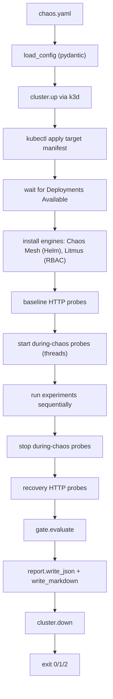

# Architecture

`chaos-ci-runner` is a thin Python orchestrator over existing CNCF tools.
The design goal is "smallest possible code surface that still answers a
real SRE question." Everything heavy (cluster, chaos primitives, Helm
releases) is delegated.

## Components

| Module | Responsibility |
|---|---|
| `chaos_ci_runner.config` | pydantic v2 schema for `chaos.yaml`. |
| `chaos_ci_runner.cluster` | k3d cluster lifecycle (`up` / `down`). |
| `chaos_ci_runner.shell` | one place that calls subprocess (kubectl, helm, k3d). |
| `chaos_ci_runner.engines.base` | `ChaosEngine` protocol + kubectl/helm helpers. |
| `chaos_ci_runner.engines.chaos_mesh` | Helm install + apply Chaos Mesh CRDs. |
| `chaos_ci_runner.engines.litmus` | Run LitmusChaos experiments as Kubernetes Jobs (no full operator). |
| `chaos_ci_runner.probes` | HTTP probes (success rate, p99 latency) for baseline / during / recovery windows. |
| `chaos_ci_runner.gate` | SLO gate evaluation: experiment pass rate + probe breaches. |
| `chaos_ci_runner.report` | Render `report.json` and `report.md`. |
| `chaos_ci_runner.cli` | typer entry point that orchestrates everything. |

## Run flow



## Engines

Both engines implement the same `ChaosEngine` Protocol:

```python
class ChaosEngine(Protocol):
    name: str
    def install(self, cluster: Cluster) -> None: ...
    def run_experiment(self, cluster: Cluster, exp: ExperimentSpec) -> ExperimentResult: ...
    def cleanup(self, cluster: Cluster) -> None: ...
```

### Chaos Mesh

`install` does `helm repo add chaos-mesh && helm upgrade --install
chaos-mesh chaos-mesh/chaos-mesh -n chaos-mesh --wait`. The k3s flags
that point the chaos daemon at containerd are pre-set so it just works
on k3d.

`run_experiment` wraps the user's `spec` in the right CRD
(`PodChaos` by default; override with `kind:`), applies it, watches
`status.experiment.desiredPhase` until it reaches `Stop` or
`AllRecovered`, then deletes the CRD.

### LitmusChaos

We deliberately do not install the Litmus operator or portal. v1 only
needs a namespace and a permissive ClusterRole bound to a service
account. `run_experiment` renders a single `batch/v1.Job` that runs
`litmuschaos/go-runner -name <experiment>` with the same env vars the
operator would inject, then watches the Job to completion.

This is enough for most pod-level experiments in the
[ChaosHub](https://hub.litmuschaos.io/) catalog. If you ever need the
full operator workflow, the engine adapter is the only thing that
changes; everything else (probes, gate, report) is unaffected.

## Probes

`HttpProbeSpec` is intentionally minimal in v1: a URL, success rate,
p99 latency, duration, interval, timeout. Probes run in three windows:

- `baseline` - synchronous, before chaos starts.
- `during` - in a background thread, started just before experiments and
  stopped right after.
- `recovery` - synchronous, after chaos ends, to verify steady state
  returns.

p99 is computed by sorting samples and indexing at `0.99 * (n - 1)`.
Good enough for CI; not pretending to be a metrics system. v2 will add
Prometheus and OTel collectors deployed inside the same k3d cluster.

## Gate

Two independent failure modes:

1. **Experiment pass rate** below `gate.min_pass_rate_pct` is a fail.
2. If `gate.fail_on_probe_breach=true`, any probe window with a success
   rate below its SLO or a p99 above its SLO is a fail.

`GateOutcome` is structured: `passed`, `pass_rate_pct`, list of
`ProbeBreach` records, and human-readable reasons. The CLI exit code
mirrors this directly.

## Why not a Go binary?

Considered. Python wins for v1 because:

- The heavy lifting is shelling out to `k3d`, `kubectl`, `helm` - languages don't matter much there.
- The AIOps / MLOps phases (Prophet, scikit-learn, Evidently) live in Python.
- Smaller code volume to read and learn from.

A Go reimplementation is on the table if/when the orchestrator outgrows
subprocess wrapping.
